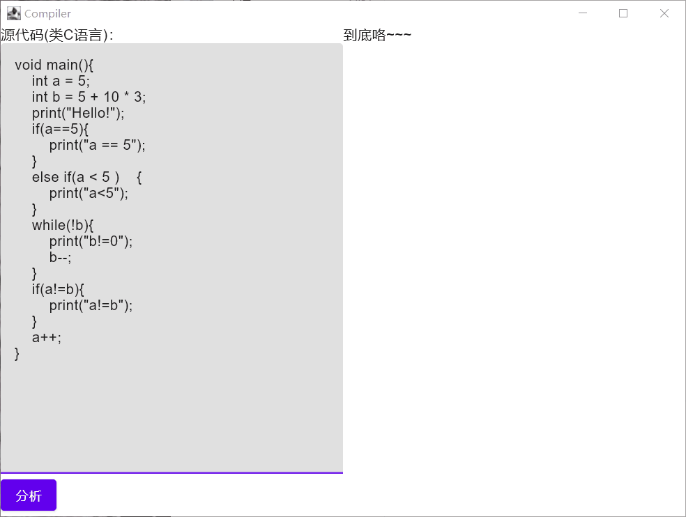
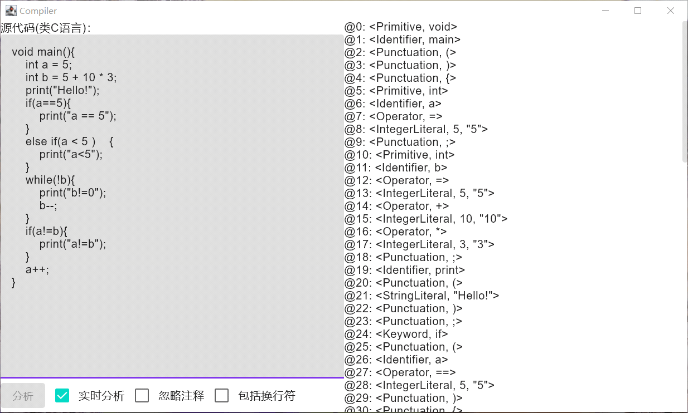
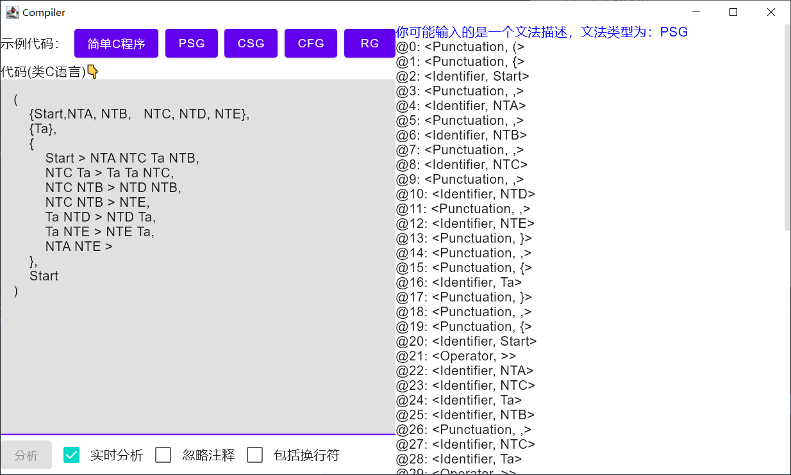
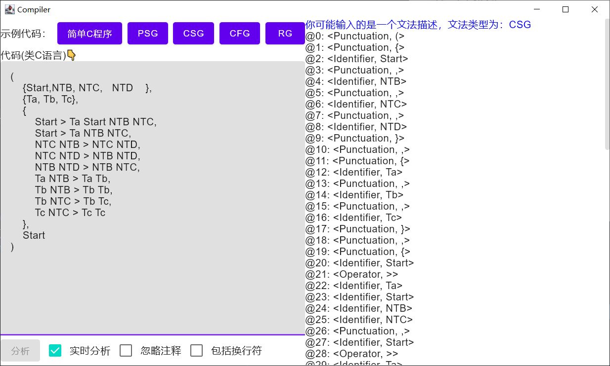
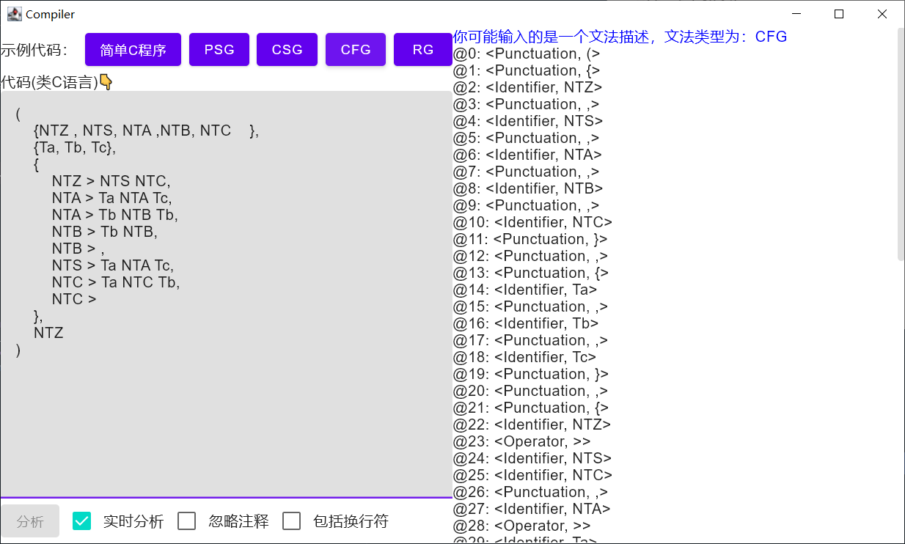
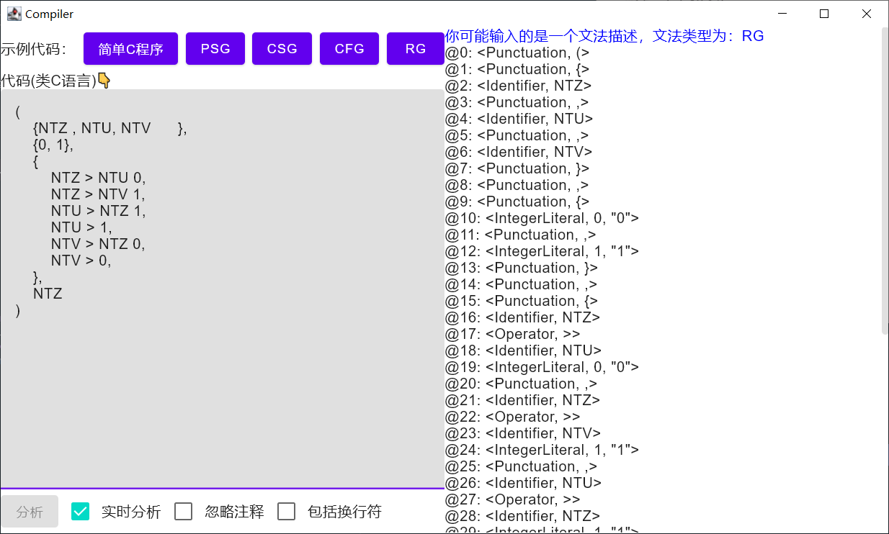

# 编译原理

编译原理实习代码。

## 运行

1. Clone源代码并用IDEA打开运行
2. 直接运行已打包程序：[下载](https://github.com/SalHe/compiler/releases)

## 简要介绍

### 词法分析

[详细文档](./docs/Scanner.md)

### 支持Token类型

- 操作符
- 字面量
- 标识符
- 边界符
- 关键字
- 基础类型
- ...

### 特性

- 分析错误报告

### 效果预览

### 语法分类

- PSG
  
- CSG
  
- CFG
  
- RG(左线性、右线性，虽然没特殊声明，但代码已做区分)
  

## 感受

这门课个人觉得还是挺有意思的，就是需要使劲啃。最后，Kotlin真好用。
