<!-- 这份文档懂的都懂，不是目前项目内容 -->

## 语言语法规则

本程序语言主要由全局变量定义和函数定义组成。

- 函数主要由函数名、参数列表以及函数体组成。
- 函数体由复合语句组成。
- 而语句可以是多个简单语句组成的复合语句，也可以是一个简单语句。
- 简单语句包括分支语句、循环语句、赋值语句。
- 分支语句由条件、分支体等组成。
- 循环语句表现为while，由条件、循环体组成。
- 赋值语句由变量、赋值符号、表达式组成。
- 条件主要表现为表达式之间的比较。
- 标识符为字母开头、并由字母和数字组成的字符串。

## 文法定义

$$
\begin{aligned}

Program &\rightarrow (Function | Variable)* \\
Function &\rightarrow Identifier \ () \ ComplexStatements \\
Variable &\rightarrow Identifier = Literal \\
Statement &\rightarrow SimpleStatement | ComplexStatements \\
ComplexStatements &\rightarrow \{SimpleStatement*\} \\
SimpleStatement &\rightarrow AssignStatement | IfStatement | WhileStatement \\
AssignStatement &\rightarrow Identifier = Literal \\
IfStatement &\rightarrow 'if' (Condition) Statement ('else' \ Statement)? \\
WhileStatement &\rightarrow 'while' (Condition) Statement\\
Condition &\rightarrow Identifier (==|!=|>=|...) Literal

\end{aligned}
$$

注：上述文法定义中使用'...'或0,1,2..,9表示终结符。`Literal`为一个token，表示了字面量，比如123为数字字面量，该token由词法分析器得来。

## 语法分析算法

主要考虑递归下降算法，对每个非终结符分别定义分析的子程序。

下列程序框图中省略了源自词法分析器中根据程序代码分析出token流，但是分析程序都是基于该token流分析的。

### Program



### Function



### Variable


注：由于赋值语句(AssignStatement)、条件(Condition)在本程序语言中逻辑一致（均为扫描一个标识符、一个操作符、一个字面量，在`Parse_Variable`和`Parse_AssignStatement`中操作符即`=`赋值符号，而在`Parse_Condition`操作符为`==`/'!='），故下面不给出流程图。但是本质上他们的语义是不一样的，同时为了方便维护，实现时还是为他们编写各自的分析子程序。

### Statement


### SimpleStatement


### ComplexStatement


### IfStatement


### WhileStatement


## 出错处理出口

简单的分析子程序如果出现了错误都会优先抛出异常并在异常中附着描述信息等可帮助用户用于诊断，而对于使用了其他分析子程序的较复杂分析子程序来说，他们主动捕获异常，如果所有的候选分析子程序都无法满足期望，则分析程序报错。

## 测试计划

### 测试1

```c++
main(){
    a = 3
    b = 5
    if( a == 3){
        a = 1
    }else{
        b =3
    }
}
```

```
正确的程序！
```

### 测试2

```c++
main(){
    a = 
    b = 5
    if( a == 3) {
        a = 1
    }else{
        b =3
    }
}
```

```
ERROR 期待初始值或右值
```

### 测试3

```c++
main(){
    a = 
    b = 5
    if( a == 3 {
        a = 1
    }else{
        b =3
    }
}
```

```
ERROR 期待右括号")"
```
